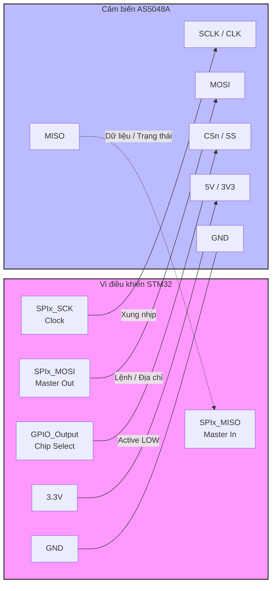

# Hướng dẫn cấu hình phần cứng và SPI cho cảm biến AS5048A

Tài liệu này giải thích chi tiết sơ đồ chân và cách cấu hình các ngoại vi trên STM32 (sử dụng STM32CubeMX) để giao tiếp với cảm biến từ tính AS5048A qua giao thức SPI.

## 1. Sơ đồ kết nối phần cứng (Pinout Diagram)

Dưới đây là sơ đồ kết nối cơ bản giữa vi điều khiển STM32 và cảm biến AS5048A.

> [!IMPORTANT]
> **Lưu ý về chân MISO:** Cảm biến AS5048A đôi khi có trở kháng đầu ra cao. Nên cân nhắc thêm một điện trở kéo lên (pull-up resistor) khoảng 10kΩ từ chân MISO lên 3.3V để đảm bảo tín hiệu MISO ổn định ở mức HIGH khi rảnh, tránh lỗi đọc sai parity.

---

## 2. Phân tích cấu hình ngoại vi trong STM32CubeMX

Để giao tiếp thành công, cần cấu hình SPI và GPIO chính xác theo yêu cầu từ Datasheet của AS5048A.

### 2.1 Cấu hình SPI (Connectivity -> SPIx)

| Tham số | Giá trị trong CubeMX | Giải thích lý do (Tại sao phải cấu hình như vậy?) |
| :--- | :--- | :--- |
| **Mode** | `Full-Duplex Master` | STM32 đóng vai trò Master tạo xung Clock và truyền lệnh. AS5048A là Slave phản hồi dữ liệu. Giao tiếp diễn ra 2 chiều đồng thời. |
| **Hardware NSS Signal** | `Disable` | Cảm biến yêu cầu điều khiển chân Chip Select (CS) rất nghiêm ngặt giữa các frame. Dùng GPIO thông thường làm CS mềm dẻo hơn NSS cứng và dễ gắn nhiều cảm biến trên cùng một bus SPI. |
| **Frame Format** | `Motorola` | Chuẩn SPI thông dụng được hỗ trợ bởi AS5048A. |
| **Data Size** | `8 Bits` hoặc `16 Bits` | Datasheet yêu cầu mỗi frame lệnh là **16-bit**. Nếu cấu hình 8-bit, thư viện sẽ tự động gửi/nhận 2 byte liên tiếp. Khuyến nghị 8-bit để thư viện HAL dễ quản lý mảng byte. |
| **First Bit** | `MSB First` | Hầu hết các cảm biến, bao gồm AS5048A, đều yêu cầu bit có trọng số cao nhất (Most Significant Bit) được truyền đi trước tiên. |
| **Prescaler (Baud Rate)** | `Baud Rate ≤ 10 MHz` | AS5048A hỗ trợ xung nhịp SPI tối đa 10 MHz. Quá tốc độ này cảm biến sẽ không đọc kịp. Ví dụ với STM32G4 (Clock 170MHz), chia `/32` (tương đương ~5.3 MHz) là một mức rất an toàn và đủ nhanh. |

#### Cấu hình SPI Mode 1 (Quan trọng nhất)
Theo datasheet (trang định dạng SPI), AS5048A lấy mẫu (sample) dữ liệu ở **cạnh xuống** (falling edge) của xung clock và dịch (shift) dữ liệu ở **cạnh lên** (rising edge). Cấu hình tương ứng trên STM32 là:

| Tham số | Giá trị | Ý nghĩa |
| :--- | :--- | :--- |
| **Clock Polarity (CPOL)** | `Low` | Mức logic của chân SCLK khi rảnh (Idle) là LOW (0V). |
| **Clock Phase (CPHA)** | `2 Edge` | Dữ liệu được lấy mẫu (sample) ở sườn thứ 2 của chu kỳ xung clock (tức là sườn xuống, vì CPOL=Low). |

> [!WARNING]
> Nếu bạn để mặc định `CPHA = 1 Edge` (SPI Mode 0), dữ liệu đọc về sẽ bị lệch đi 1 bit, dẫn đến sai dữ liệu hoàn toàn, đồng thời gây ra **Lỗi Parity** liên tục trong thư viện.

### 2.2 Cấu hình GPIO cho chân Chip Select (CS)

Chọn một chân GPIO bất kỳ (ví dụ `PA4`) và cấu hình nó làm GPIO_Output:

| Tham số | Giá trị | Giải thích lý do |
| :--- | :--- | :--- |
| **GPIO output level** | `High` | AS5048A sử dụng CS Active LOW. Do đó, trạng thái mặc định khi vi điều khiển vừa khởi động phải là `High` để cảm biến ở trạng thái nghỉ, không lắng nghe tín hiệu trên bus SPI. |
| **GPIO mode** | `Output Push Pull` | Chế độ ngõ ra tiêu chuẩn để xuất mức logic 0 hoặc 1 một cách dứt khoát. |
| **GPIO Pull-up/Pull-down** | `No pull-up and no pull-down` | Không cần thiết vì Push-Pull đã tự điều khiển được mức điện áp ổn định. |
| **Maximum output speed** | `High` hoặc `Very High` | Xung nhịp SPI khá cao (vài MHz). Chân CS cần có tốc độ đáp ứng nhanh để đảm bảo cạnh sườn đi xuống dứt khoát trước khi xung Clock đầu tiên của SPI xuất hiện. |
| **User Label** | `AS5048A_CS` | Đặt tên để code sinh ra có định nghĩa macro dễ đọc (ví dụ `AS5048A_CS_GPIO_Port`). |

---

## 3. Luồng dữ liệu đọc (Pipeline Read Mechanism)

Bên cạnh phần cứng, việc giao tiếp với AS5048A đòi hỏi thư viện phần mềm phải xử lý được cơ chế "Pipeline" (trễ 1 frame). Để đọc góc, thư viện thực hiện quá trình sau:

1. **Kéo CS xuống LOW**: Đánh thức cảm biến.
2. **Gửi lệnh READ (Frame 1)**: STM32 gửi lệnh đọc (kèm địa chỉ thanh ghi góc `0x3FFF` và Parity). Trong lúc này, cảm biến trả về dữ liệu của lệnh *trước đó*. Ta bỏ qua dữ liệu thu được ở bước này.
3. **Kéo CS lên HIGH**: Kết thúc frame 1. Phải kéo lên HIGH để cảm biến xử lý lệnh.
4. **Kéo CS xuống LOW**: Bắt đầu frame 2.
5. **Gửi lệnh NOP (Frame 2)**: STM32 gửi lệnh NOP (vô nghĩa, thường là `0xC000`). Đồng thời, do được Clock, cảm biến sẽ đẩy ra dữ liệu góc của *Frame 1* lên chân MISO. Đây chính là dữ liệu thực tế ta cần lấy.
6. **Kéo CS lên HIGH**: Kết thúc quá trình đọc.

*(Thư viện `UserLibs/encoder_as5048a` đã xử lý toàn bộ logic tính toán parity và pipeline read này).*
