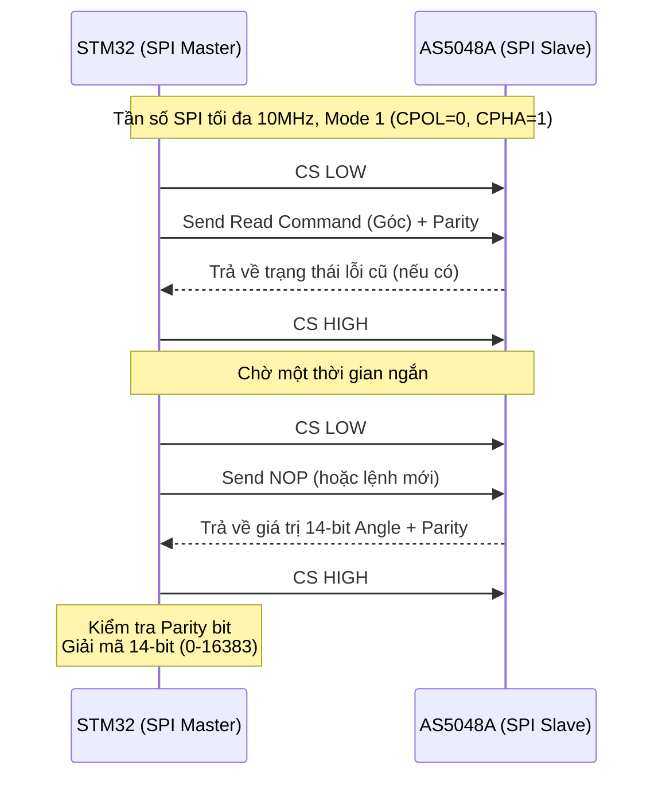

# AS5048A Magnetic Encoder Library

Thư viện giao tiếp SPI cho cảm biến vị trí góc từ tính **AS5048A** (14-bit resolution).

## 🚀 Tính năng chính
- Đọc góc cơ học 14-bit (Độ phân giải ~0.0219°).
- Đọc thông tin chẩn đoán lỗi (Diagnostic/AGC) để kiểm tra trạng thái nam châm.
- Hỗ trợ STM32 HAL SPI, tự động quản lý chân Chip Select (CS).
- Xử lý Parity Bit để đảm bảo toàn vẹn dữ liệu.

---

## 📐 Kiến trúc & Giao tiếp



---

## 🛠 Hướng dẫn sử dụng

### 1. Khởi tạo
```c
#include "as5048a.h"

AS5048A_Handle_t encoder;

// Khởi tạo giao tiếp SPI1, sử dụng chân GPIOC Pin 4 làm CS
AS5048A_Status_t status = AS5048A_Init(&encoder, &hspi1, GPIOC, GPIO_PIN_4);

if (status == AS5048A_OK) {
    printf("Encoder khien tao thanh cong!\n");
}
```

### 2. Đọc chẩn đoán (Diagnostics)
Rất hữu ích khi lắp ráp để kiểm tra khoảng cách nam châm có đúng không:

```c
AS5048A_ReadDiagnostics(&encoder);

// AGC (Automatic Gain Control): 0-255. Quá cao/thấp nghĩa là nam châm quá xa/gần.
printf("AGC Value: %d\n", encoder.agc_value);

if (encoder.comp_high) printf("Loi: Tu truong qua manh!\n");
if (encoder.comp_low)  printf("Loi: Tu truong qua yeu!\n");
```

### 3. Đọc góc liên tục
Sử dụng trong vòng lặp FOC:

```c
if (AS5048A_ReadAngle(&encoder) == AS5048A_OK) {
    // Giá trị thô (0 - 16383)
    uint16_t raw_val = encoder.raw_angle;
    
    // Đơn vị Độ (0 - 359.9)
    float deg = encoder.angle_deg;
    
    // Đơn vị Radian (0 - 2*PI)
    float rad = encoder.angle_rad;
}
```
