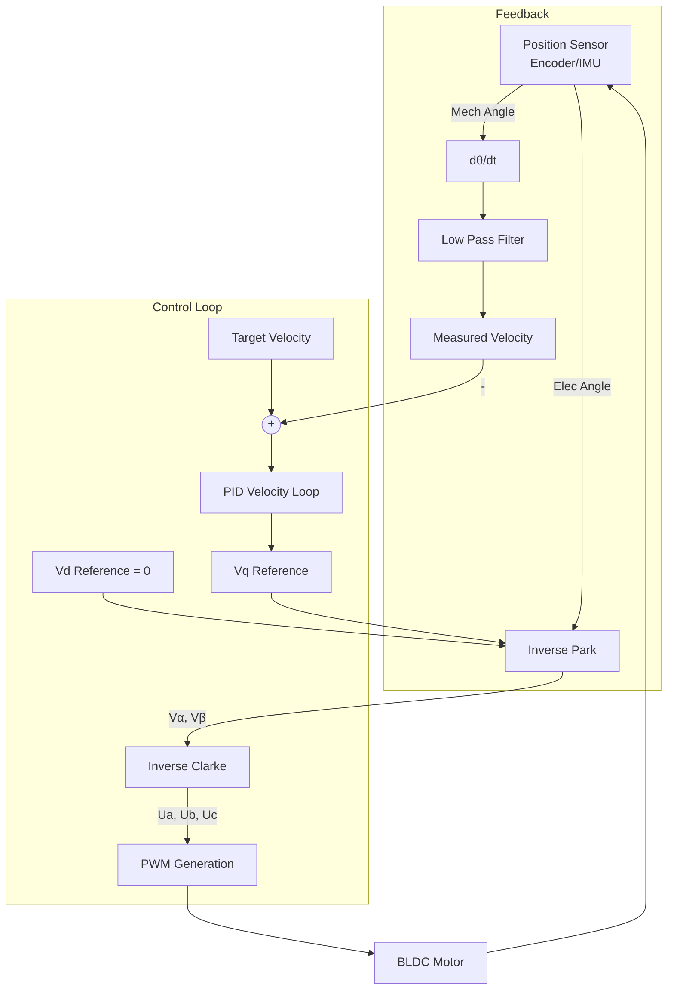

# FOC Control Library

Thư viện **Field Oriented Control (FOC)** chuyên dụng để điều khiển động cơ không chổi than (BLDC/PMSM) bằng STM32 HAL. Thư viện này đã được tối ưu hóa, loại bỏ các phụ thuộc Arduino và chạy trực tiếp bằng ngắt Timer để đảm bảo độ chính xác thời gian thực.

## 🚀 Tính năng chính
- Điều khiển **Velocity Closed-Loop** với PID và Low-Pass Filter.
- Hỗ trợ biến đổi hệ tọa độ đầy đủ: **Clarke, Park, Inverse Park, Inverse Clarke**.
- Tạo tín hiệu PWM 3 pha (Space Vector Modulation đơn giản hoặc Sinusoidal).
- Căn chỉnh tự động (Alignment sequence) để xác định góc điện "Zero" của rotor.

---

## 📐 Kiến trúc FOC



---

## 🛠 Hướng dẫn sử dụng

### 1. Khởi tạo FOC
Gọi hàm `FOC_Init` để cấu hình Timer, PWM và thông số vật lý của motor:

```c
#include "foc.h"

FOC_Handle_t foc;

// Khởi tạo FOC: Timer 2, 3 kênh PWM, ARR=4249, 7 cặp cực, giới hạn 1.0V, Ts = 10ms
FOC_Init(&foc, &htim2, TIM_CHANNEL_1, TIM_CHANNEL_2, TIM_CHANNEL_3,
         4249.0f, 7, 1.0f, 0.01f);
```

### 2. Cấu hình PID và LPF
Trước khi chạy, cần setup thông số cho bộ điều khiển tốc độ:

```c
// Lọc nhiễu tốc độ (Alpha = 0.9, lọc mạnh)
FOC_SetLPF_Vel(&foc, 0.9f);

// Cài đặt PID: Kp=0.05, Ki=0.01, Kd=0, output_limit = ±1.0V
FOC_SetPID_Vel(&foc, 0.05f, 0.01f, 0.0f, -1.0f, 1.0f);
```

### 3. Căn chỉnh Rotor (Alignment) - BẮT BUỘC (Nếu dùng Encoder)
Để FOC hoạt động, từ trường Stator và Rotor phải đồng bộ. Nếu dùng encoder, bạn phải ép rotor về vị trí D-axis:

```c
FOC_Start(&foc);
// Ép rotor đứng yên bằng điện áp nhỏ trong 500ms
for (int i = 0; i < 50; i++) {
    FOC_AlignD(&foc, foc.voltage_limit);
    HAL_Delay(10);
}
// Sau khi rotor ổn định, lấy góc encoder làm mốc Zero
FOC_CalibrateAngle(&foc, encoder_angle_rad);
```
*(Lưu ý: Nếu sử dụng `Attitude Library` với IMU gắn trên động cơ, bước này có thể bỏ qua vì IMU cung cấp góc tuyệt đối)*.

### 4. Chạy vòng lặp điều khiển kín (Closed-loop)
Đặt trong ngắt Timer (`HAL_TIM_PeriodElapsedCallback`) để chạy chuẩn xác:

```c
// Góc cơ học hiện tại từ Encoder hoặc Attitude Library
float current_angle = AS5048A_GetAngleRad(&encoder);

// Tốc độ mục tiêu: 1.0 rad/s
float target_velocity = 1.0f;

// Chạy FOC Pipeline (sẽ tự động tạo PWM)
FOC_RunVelocity(&foc, current_angle, target_velocity);
```
